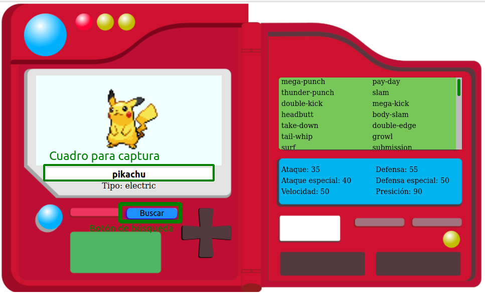

# Pokedex LaunchX

Para este proyecto se utiliza el [pokeAPI](https://pokeapi.co/).

Para el diseño se utilizó un archivo [SVG](./src/img/PokedexFondo.svg) que por practicidad se exporto a PNG.

Con una vista final como la que se muestra a continuación.

 

